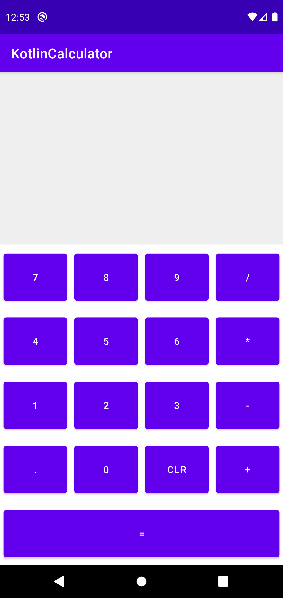
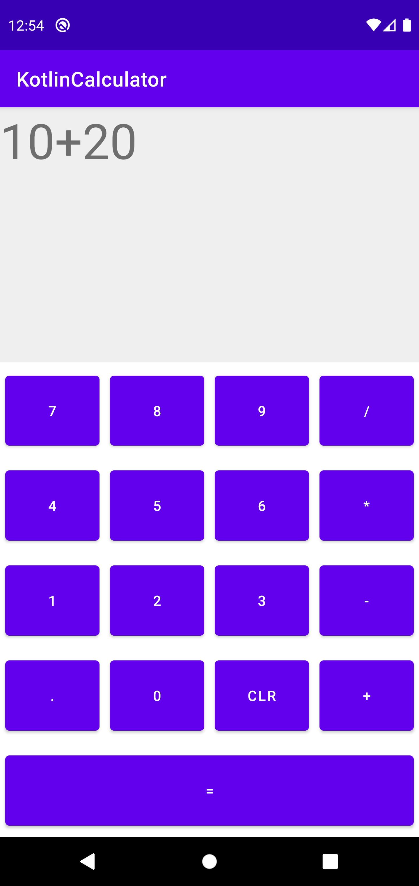
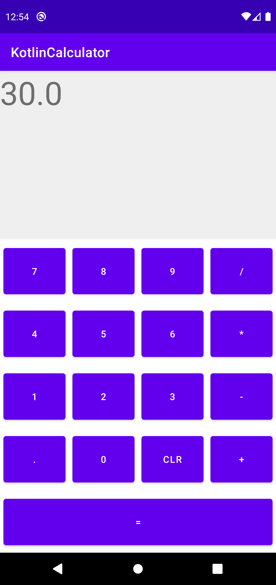

# KotlinCalculator :tada: :rocket:
Simple calculator app built using kotlin

## Technologies used :muscle:
- Core Android
- Kotlin

## App UI ( Onboarding and Different Screens)
**App Screens** 

### Made with ❤ by Avijeet , using Kotlin
